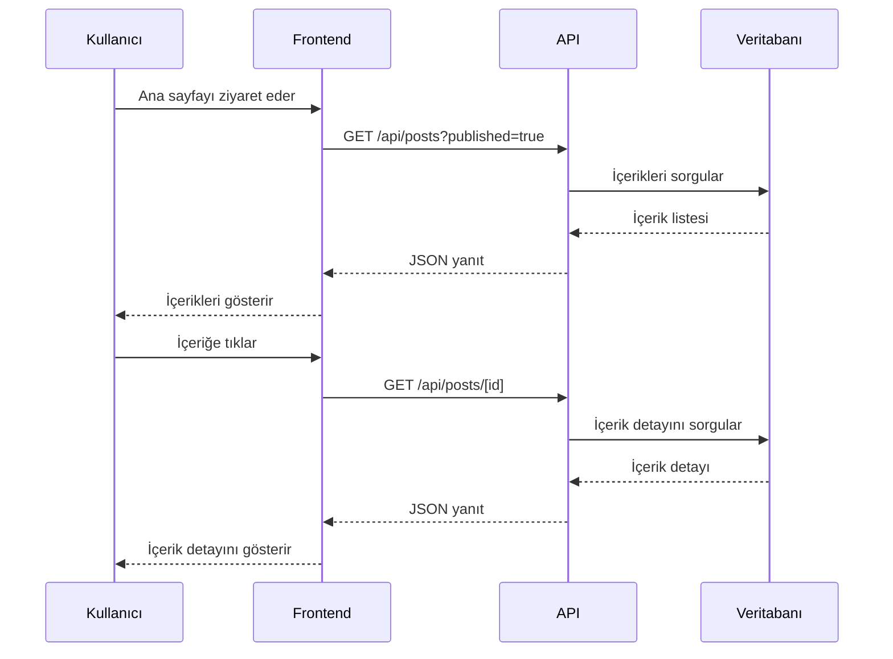
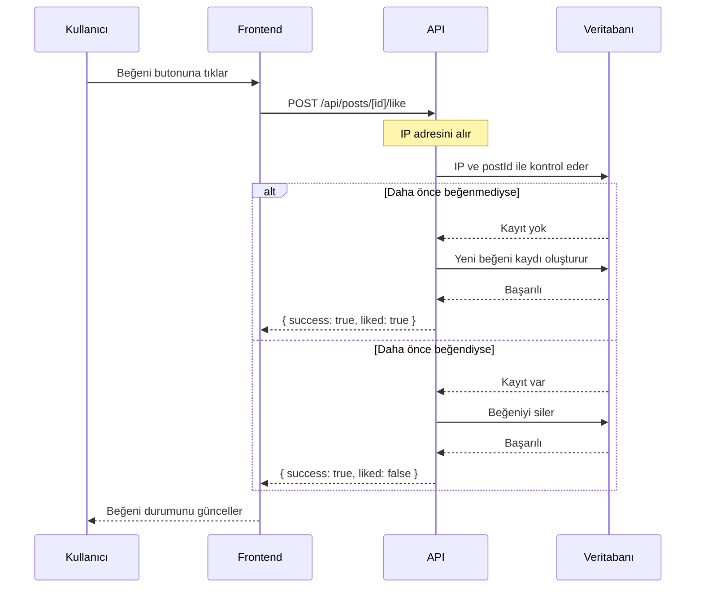
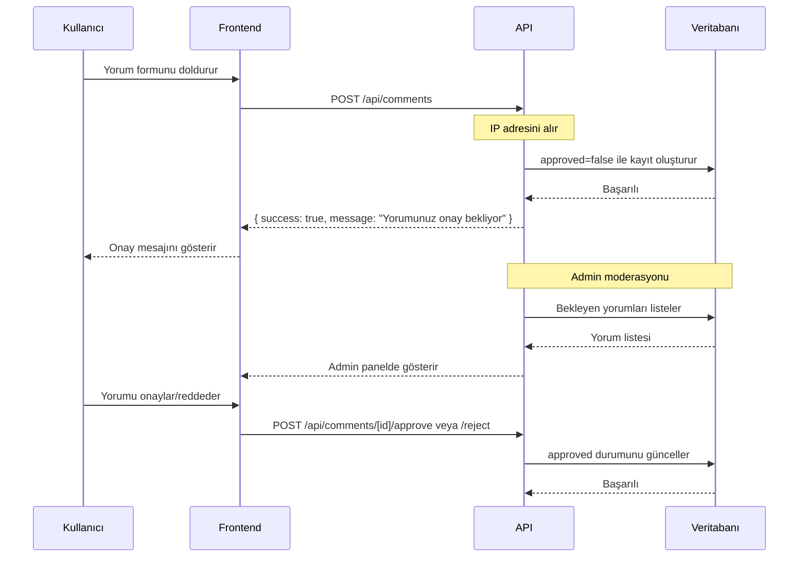
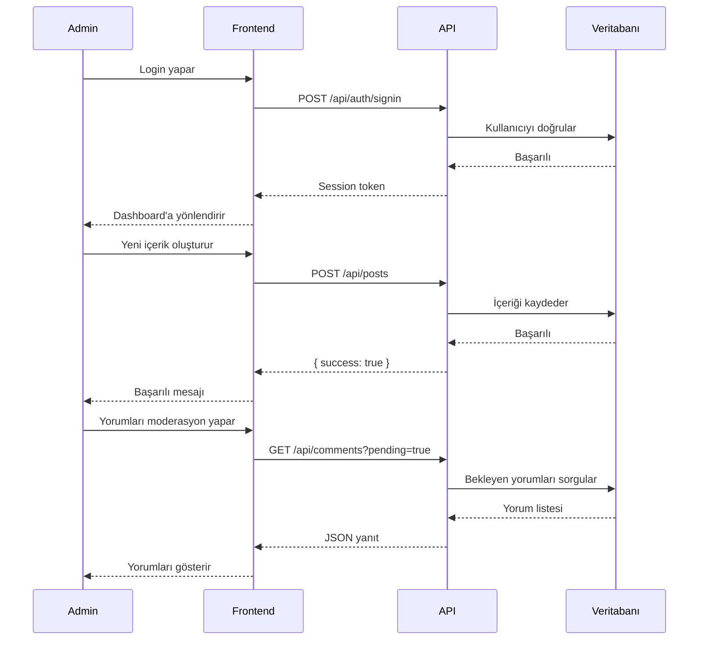

# TitanByte Blog - Proje Mimarisi

## Teknoloji Yığını

| Bileşen | Teknoloji |
|---------|-----------|
| Frontend Framework | Next.js 15 (App Router) |
| Dil | TypeScript |
| Stil | Tailwind CSS |
| UI Bileşenleri | shadcn/ui |
| Veritabanı | PostgreSQL (Supabase) |
| ORM | Prisma |
| Metin Editörü | TinyMCE |
| Deployment | Vercel |
| Authentication | NextAuth.js (Admin için) |

## Proje Yapısı

```
titanbyte/
├── app/
│   ├── (public)/                    # Public sayfalar
│   │   ├── page.tsx                 # Ana sayfa - içerik listesi
│   │   ├── post/[slug]/page.tsx     # İçerik detay
│   │   ├── category/[slug]/page.tsx # Kategori sayfası
│   │   ├── about/page.tsx           # Hakkımızda (AdSense için)
│   │   ├── contact/page.tsx         # İletişim (AdSense için)
│   │   ├── privacy/page.tsx         # Gizlilik Politikası (AdSense için)
│   │   └── terms/page.tsx           # Kullanım Şartları (AdSense için)
│   ├── (admin)/                     # Admin paneli
│   │   ├── admin/
│   │   │   ├── page.tsx             # Dashboard
│   │   │   ├── posts/
│   │   │   │   ├── page.tsx         # İçerik listesi
│   │   │   │   ├── new/page.tsx     # Yeni içerik
│   │   │   │   └── [id]/edit/page.tsx # İçerik düzenle
│   │   │   ├── categories/
│   │   │   │   ├── page.tsx         # Kategori listesi
│   │   │   │   └── new/page.tsx     # Yeni kategori
│   │   │   └── comments/
│   │   │       └── page.tsx         # Yorum moderasyonu
│   │   └── layout.tsx               # Admin layout
│   ├── api/                         # API Route'ları
│   │   ├── posts/
│   │   │   ├── route.ts             # GET (list), POST (create)
│   │   │   └── [id]/
│   │   │       ├── route.ts         # GET, PUT, DELETE
│   │   │       └── like/
│   │   │           └── route.ts     # POST (beğeni)
│   │   ├── comments/
│   │   │   ├── route.ts             # POST (yorum ekle)
│   │   │   └── [id]/
│   │   │       ├── approve/route.ts # POST (onayla)
│   │   │       └── reject/route.ts  # POST (reddet)
│   │   └── categories/
│   │       └── route.ts             # GET, POST, PUT, DELETE
│   ├── layout.tsx                   # Root layout
│   └── globals.css                  # Global stiller
├── components/
│   ├── ui/                          # shadcn/ui bileşenleri
│   ├── public/
│   │   ├── Header.tsx               # Site başlığı
│   │   ├── Footer.tsx               # Site alt bilgisi
│   │   ├── PostCard.tsx             # İçerik kartı
│   │   ├── PostDetail.tsx           # İçerik detay
│   │   ├── CommentForm.tsx          # Yorum formu
│   │   ├── CommentList.tsx          # Yorum listesi
│   │   └── LikeButton.tsx           # Beğeni butonu
│   ├── admin/
│   │   ├── AdminSidebar.tsx         # Admin yan menü
│   │   ├── PostForm.tsx             # İçerik formu
│   │   ├── CategoryForm.tsx         # Kategori formu
│   │   └── CommentModeration.tsx    # Yorum moderasyon
│   └── editor/
│       └── RichTextEditor.tsx       # TinyMCE wrapper
├── lib/
│   ├── supabase.ts                  # Supabase client
│   ├── prisma.ts                    # Prisma client
│   ├── types.ts                     # TypeScript tipleri
│   └── utils.ts                     # Yardımcı fonksiyonlar
├── prisma/
│   └── schema.prisma                # Veritabanı şeması
├── public/
│   └── images/                      # Görseller
├── .env.local                       # Environment değişkenleri
├── .env.example                     # Environment şablonu
├── next.config.mjs                  # Next.js yapılandırması
├── tailwind.config.ts               # Tailwind yapılandırması
├── tsconfig.json                    # TypeScript yapılandırması
└── package.json                     # Bağımlılıklar
```

## Veritabanı Şeması

### Tablolar

#### Category (Kategoriler)
```prisma
model Category {
  id        String   @id @default(cuid())
  name      String   @unique
  slug      String   @unique
  createdAt DateTime @default(now())
  updatedAt DateTime @updatedAt
  posts     Post[]
}
```

#### Post (İçerikler)
```prisma
model Post {
  id          String   @id @default(cuid())
  title       String
  slug        String   @unique
  content     String   @db.Text
  excerpt     String?  @db.Text
  coverImage  String?
  categoryId  String
  category    Category @relation(fields: [categoryId], references: [id])
  published   Boolean  @default(false)
  createdAt   DateTime @default(now())
  updatedAt   DateTime @updatedAt
  likes       Like[]
  comments    Comment[]
}
```

#### Like (Beğeniler)
```prisma
model Like {
  id        String   @id @default(cuid())
  postId    String
  post      Post     @relation(fields: [postId], references: [id], onDelete: Cascade)
  ipAddress String
  createdAt DateTime @default(now())

  @@unique([postId, ipAddress])
  @@index([postId])
}
```

#### Comment (Yorumlar)
```prisma
model Comment {
  id        String   @id @default(cuid())
  postId    String
  post      Post     @relation(fields: [postId], references: [id], onDelete: Cascade)
  author    String
  content   String   @db.Text
  approved  Boolean  @default(false)
  ipAddress String
  createdAt DateTime @default(now())

  @@index([approved])
  @@index([postId])
}
```

#### AdminUser (Yönetici Kullanıcıları)
```prisma
model AdminUser {
  id            String    @id @default(cuid())
  email         String    @unique
  name          String?
  password      String
  createdAt     DateTime  @default(now())
  updatedAt     DateTime  @updatedAt
}
```

## Sistem Akışları

### 1. İçerik Okuma Akışı



### 2. Beğeni Akışı



### 3. Yorum Akışı



### 4. Admin Panel Akışı



## API Endpoint'leri

### Public API'ler

| Endpoint | Method | Açıklama |
|----------|--------|----------|
| `/api/posts` | GET | Yayınlanmış içerikleri listeler |
| `/api/posts/[id]` | GET | İçerik detayını getirir |
| `/api/posts/[id]/like` | POST | Beğeni ekler/kaldırır |
| `/api/posts/[id]/comments` | GET | Onaylanmış yorumları listeler |
| `/api/comments` | POST | Yeni yorum ekler |
| `/api/categories` | GET | Kategorileri listeler |
| `/api/category/[slug]/posts` | GET | Kategoriye göre içerikleri listeler |

### Admin API'leri

| Endpoint | Method | Açıklama |
|----------|--------|----------|
| `/api/admin/posts` | GET | Tüm içerikleri listeler |
| `/api/admin/posts` | POST | Yeni içerik oluşturur |
| `/api/admin/posts/[id]` | GET | İçerik detayını getirir |
| `/api/admin/posts/[id]` | PUT | İçeriği günceller |
| `/api/admin/posts/[id]` | DELETE | İçeriği siler |
| `/api/admin/categories` | GET | Tüm kategorileri listeler |
| `/api/admin/categories` | POST | Yeni kategori oluşturur |
| `/api/admin/categories/[id]` | PUT | Kategoriyi günceller |
| `/api/admin/categories/[id]` | DELETE | Kategoriyi siler |
| `/api/admin/comments` | GET | Tüm yorumları listeler |
| `/api/admin/comments/pending` | GET | Bekleyen yorumları listeler |
| `/api/admin/comments/[id]/approve` | POST | Yorumu onaylar |
| `/api/admin/comments/[id]/reject` | POST | Yorumu reddeder |
| `/api/admin/comments/[id]` | DELETE | Yorumu siler |

## Güvenlik Önlemleri

1. **IP Tabanlı Beğeni Kontrolü**: Her IP adresi bir içeriği sadece bir kez beğenebilir
2. **Yorum Moderasyonu**: Tüm yorumlar admin onayı gerektirir
3. **Admin Authentication**: Admin paneli için NextAuth.js ile güvenli giriş
4. **Rate Limiting**: API endpoint'lerinde hız sınırlama
5. **Input Validation**: Tüm girdiler validasyonu
6. **SQL Injection Koruması**: Prisma ORM ile otomatik koruma
7. **XSS Koruması**: React ve TinyMCE ile otomatik koruma

## SEO Optimizasyonu

### Google SEO Gereksinimleri
1. **Meta Tags**: Her sayfa için dinamik meta etiketleri (title, description, keywords)
2. **Sitemap**: Otomatik sitemap oluşturma (`/sitemap.xml`)
3. **Robots.txt**: Arama motoru yönergeleri
4. **Open Graph**: Sosyal medya paylaşım optimizasyonu (og:title, og:description, og:image, og:url)
5. **Twitter Cards**: Twitter paylaşım optimizasyonu
6. **Structured Data**: Schema.org markup (Article, BreadcrumbList, WebSite)
7. **Canonical URLs**: Yinelenen içerik önleme
8. **Hreflang Tags**: Çoklu dil desteği için (gelecekte)
9. **Meta Robots**: Noindex, nofollow yönergeleri
10. **JSON-LD**: Google'ın tercih ettiği structured data formatı

### Google AdSense Gereksinimleri
1. **Orijinal İçerik**: Tüm içerikler orijinal ve benzersiz olmalı
2. **Navigasyon**: Net ve anlaşılır site yapısı
3. **İletişim Sayfası**: İletişim bilgileri
4. **Gizlilik Politikası**: Privacy Policy sayfası
5. **Kullanım Şartları**: Terms of Service sayfası
6. **Hakkımızda**: About Us sayfası
7. **Reklam Alanları**: AdSense için uygun reklam alanları
8. **Mobil Uyumluluk**: Responsive tasarım
9. **Yükleme Hızı**: Hızlı sayfa yüklenme süreleri
10. **Kullanıcı Deneyimi**: İyi UX/UI tasarımı

### Lighthouse Optimizasyonu
1. **Performance (Performans)**:
   - Core Web Vitals (LCP, FID, CLS)
   - Image optimization (WebP, lazy loading)
   - Code splitting
   - Font optimization
   - Minification

2. **Accessibility (Erişilebilirlik)**:
   - ARIA labels
   - Alt text for images
   - Keyboard navigation
   - Color contrast
   - Screen reader support

3. **Best Practices (En İyi Uygulamalar)**:
   - HTTPS
   - Modern JavaScript
   - No deprecated APIs
   - Secure context
   - Proper error handling

4. **SEO (Arama Motoru Optimizasyonu)**:
   - Meta descriptions
   - Heading hierarchy
   - Semantic HTML
   - Mobile-friendly
   - Fast loading

## Deployment Adımları

1. **Supabase Kurulumu** (Supabase MCP kullanarak):
   - Supabase projesi oluştur
   - Veritabanı tablolarını oluştur (migrations ile)
   - API URL ve anon key al
   - Environment değişkenlerini yapılandır

2. **GitHub Sürüm Kontrolü** (GitHub MCP kullanarak):
   - GitHub repository oluştur
   - Initial commit yap
   - Branch yapısı oluştur (main, develop)
   - CI/CD pipeline ayarla

3. **Vercel Deployment**:
   - Vercel projesi oluştur
   - Environment değişkenlerini ekle
   - Deploy et
   - Domain ayarlarını yap
   - SSL sertifikası otomatik olarak Vercel tarafından sağlanır

4. **Post-Deployment**:
   - Lighthouse testlerini çalıştır
   - SEO kontrolü yap
   - AdSense başvurusu için hazırlık
   - Monitoring ayarla
